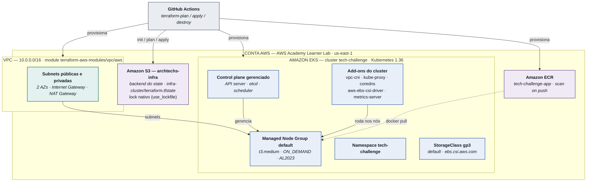

# fiap-fase3-infraestrutura

## Introdução

Infraestrutura do Tech Challenge Fase 3. O Terraform em `infra/` provisiona um
cluster Kubernetes no Amazon EKS, VPC com subnets públicas/privadas, NAT Gateway, addons, managed
node group e repositório ECR, além dos recursos de cluster compartilhados como namespace e
StorageClass.

## Índice

- [Propósito](#propósito)
- [Tecnologias](#tecnologias)
- [Estrutura do repositório](#estrutura-do-repositório)
- [Arquitetura deste Repositório](#arquitetura-deste-repositório)
- [Pré-requisitos](#pré-requisitos)
- [Provisionar o ambiente](#provisionar-o-ambiente)
- [Regras de integração](#regras-de-integração)
- [Publicando a imagem no ECR](#publicando-a-imagem-no-ecr)
- [Diagnóstico do cluster](#diagnóstico-do-cluster)
- [Conectar o kubectl ao cluster](#conectar-o-kubectl-ao-cluster)
- [Pipeline no GitHub Actions](#pipeline-no-github-actions)
- [Integração com os outros repositórios](#integração-com-os-outros-repositórios)

---

## Propósito

- Provisionar o cluster Kubernetes completo no Amazon EKS (control plane, addons de rede e
  storage, managed node group) e a VPC em que ele roda via Terraform.
- Recursos compartilhados de cluster: cria o namespace `tech-challenge`, a StorageClass
  `gp3` default e os addons que os workloads dependem (`aws-ebs-csi-driver` para
  PersistentVolumeClaims, `metrics-server` para HPA).
- Registro de imagens: provisiona o repositório Amazon ECR usado pela pipeline da aplicação para publicar a imagem Docker.

## Tecnologias
- Kubernetes 1.36
- Terraform 1.10.0
- Componentes AWS:
  - EKS (cluster Kubernetes)
  - VPC (subnets públicas/privadas, Internet Gateway, NAT Gateway)
  - ECR (repositório de imagem Docker)
  - S3 (backend do Terraform)

## Estrutura do repositório

```
.github/workflows/  pipeline de plan, apply e destroy
infra/
├── versions.tf     bloco terraform{} — required_version, required_providers
├── backend.tf      bloco terraform{} — backend "s3"
├── providers.tf    providers aws e kubernetes
├── main.tf         VPC, EKS + addons, node group, ECR, namespace, StorageClass
├── variables.tf    input variables
└── outputs.tf      contrato de integração com os outros repositórios
script-criar-backend.sh   bootstrap idempotente do bucket S3 do state (CI + uso manual)
```

## Arquitetura deste Repositório

Componentes provisionados por **este** repositório e como se relacionam com o restante do
projeto (pipeline que os cria, e os outros repositórios que os consomem):



## Pré-requisitos
- Terraform: >= 1.10.0
- kubectl: compatível com 1.36
- AWS CLI: v2

---

## Provisionar o ambiente

Os `.tf` ficam em `infra/`:

```bash
cd infra
terraform init
terraform fmt
terraform validate
terraform plan
terraform apply
```

## Regras de integração

Regras que os repositórios consumidores seguem ao ler os outputs deste módulo:

- **`key` distinta por repositório.** Todos usam o bucket `archtechs-infra`, mas cada root
  module precisa da própria chave como por exemplo: `database/terraform.tfstate`.
- **Não recrie o que já existe.** O namespace e a StorageClass são criados aqui; use
  `local.infra.namespace` e `local.infra.storage_class_name`.

## Publicando a imagem no ECR

O repositório ECR é provisionado aqui, segue um exemplo de como subir uma imagem:

```bash
REPO=$(terraform -chdir=infra output -raw ecr_repository_url)

docker build --platform linux/amd64 -t "$REPO:$GIT_SHA" .
aws ecr get-login-password --region us-east-1 | docker login --username AWS --password-stdin "$REPO"
docker push "$REPO:$GIT_SHA"
```

---

## Diagnóstico do cluster

```bash
kubectl get nodes -o wide
kubectl get pods -n kube-system
kubectl get storageclass
kubectl top nodes
kubectl get events -A --sort-by=.lastTimestamp | tail -30
kubectl port-forward -n tech-challenge service/spring-app-service 8080:80  # ver "Conectar o kubectl ao cluster"

aws eks describe-nodegroup --cluster-name tech-challenge --nodegroup-name default --region us-east-1
aws eks describe-addon --cluster-name tech-challenge --addon-name aws-ebs-csi-driver --region us-east-1
aws eks list-access-entries --cluster-name tech-challenge --region us-east-1
```

---

## Conectar o kubectl ao cluster

```bash
aws eks update-kubeconfig --region us-east-1 --name tech-challenge
kubectl get nodes
```

O mesmo comando sai pronto no output `configure_kubectl`.

### Acessar a aplicação da máquina local

O `kubectl port-forward` abre um túnel entre uma porta da sua máquina e um Service (ou pod) do
cluster — é o jeito de falar com a API sem depender do API Gateway.

Os nomes vêm do repositório da aplicação, não deste; confira o que está publicado no namespace:

```bash
kubectl get svc,deploy -n tech-challenge
```

```bash
# Deployment da API: porta 8080 do container -> 8080 na máquina local
kubectl port-forward -n tech-challenge deployment/tech-challenge-app 8080:8080
```

Com o port forward aberto, a API fica acessível na rota `http://localhost:8080`.

---

## Pipeline no GitHub Actions

| Workflow | Dispara em | O que faz |
| --- | --- | --- |
| `terraform-plan.yml` | Abertura de pull request para a `main`, ou manual | `fmt -check`, `init`, `validate`, `plan` |
| `terraform-apply.yml` | Merge de pull request na `main`, ou manual | `init`, `apply -auto-approve`, `output` |
| `terraform-destroy.yml` | só manual | exige a palavra `destroy` digitada, depois `destroy -auto-approve` |

As pipelines dependem de 2 secrets:
- `AWS_CREDENTIALS`: contém as credenciais necessárias da AWS. Elas extraem as informações do secret e criam estas 3 variáveis em tempo de execução:
  - `AWS_ACCESS_KEY_ID`
  - `AWS_SECRET_ACCESS_KEY`
  - `AWS_SESSION_TOKEN`
  
  Segue um exemplo do conteúdo deste secret que deve ser seguido:
  ```bash
  aws_access_key_id=...
  aws_secret_access_key=...
  aws_session_token=...
  ```
- `NEW_RELIC_LICENSE_KEY`: chavem de licença do New Relic, ferramenta de APM utilizada no projeto.

> Nota: As credenciais AWS expiram a cada 4 horas, portanto novas chaves devem ser criadas e atualizadas no secret sempre que for rodar a pipeline. Para fazer isso, basta reuniciar o lab do AWS Academy.

---

## Integração com os outros repositórios

Os outputs de `infra/outputs.tf` expõe os ids dos recursos provisionados por este repositório para que os outros repositórios possam fazer a devida integração com o cluster Kubernetes e seus recursos.
