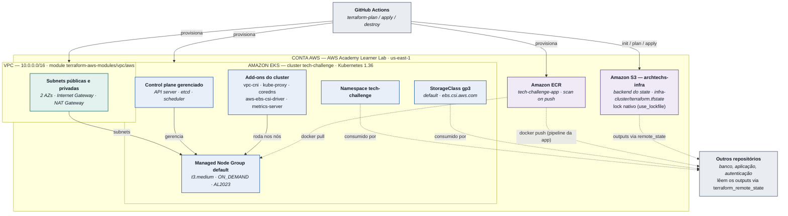

# fiap-fase3-infraestrutura

Infraestrutura do **Tech Challenge Fase 3 (FIAP)**.

O Terraform em `infra/` provisiona um cluster **Amazon EKS** — VPC com subnets
públicas/privadas, NAT Gateway, addons, managed node group e repositório ECR — mais os
recursos de cluster compartilhados (namespace e StorageClass default).

**Este repositório não implanta o banco de dados nem a aplicação.** Esses componentes vivem
em repositórios separados, que se integram a este lendo os outputs do state remoto em S3 —
ver [Integração com os outros repositórios](#integração-com-os-outros-repositórios).

## Índice

- [Tecnologias utilizadas](#tecnologias-utilizadas)
- [Diagrama de arquitetura](#diagrama-de-arquitetura)
- [Estrutura do repositório](#estrutura-do-repositório)
- [Pré-requisitos](#pré-requisitos)
- [1. Provisionar o ambiente](#1-provisionar-o-ambiente)
- [2. Conectar o kubectl ao cluster](#2-conectar-o-kubectl-ao-cluster)
- [3. Pipeline no GitHub Actions](#3-pipeline-no-github-actions)
- [Integração com os outros repositórios](#integração-com-os-outros-repositórios)
- [Diagnóstico do cluster](#diagnóstico-do-cluster)

---

## Tecnologias utilizadas

| Categoria | Item |
| --- | --- |
| IaC | Terraform `>= 1.10.0` (locking nativo do backend S3) |
| Provider | `hashicorp/aws ~> 6.61` |
| Provider | `hashicorp/kubernetes ~> 3.2` |
| Módulo | `terraform-aws-modules/vpc/aws ~> 6.7` |
| Orquestração | Amazon EKS (control plane + addons `vpc-cni`, `kube-proxy`, `coredns`, `aws-ebs-csi-driver`, `metrics-server` + managed node group) |
| Rede | Amazon VPC (subnets públicas/privadas, Internet Gateway, NAT Gateway) |
| Registro de imagens | Amazon ECR |
| Estado remoto | Amazon S3 (backend do Terraform, lock nativo) |
| IAM | Role `LabRole` pré-existente do AWS Academy Learner Lab (reaproveitada, nenhuma role nova é criada) |
| CI/CD | GitHub Actions (`terraform-plan.yml`, `terraform-apply.yml`, `terraform-destroy.yml`) |
| Ambiente | AWS Academy Learner Lab (credenciais de sessão temporárias) |

## Diagrama de arquitetura

Componentes provisionados por **este** repositório e como se relacionam com o restante do
projeto (pipeline que os cria, e os outros repositórios que os consomem):



Para a arquitetura combinada dos quatro repositórios do projeto (fluxo completo de uma
requisição, legenda de cores e tabela de responsabilidades), ver
[`docs/diagrama-componentes-c4.md`](docs/diagrama-componentes-c4.md).

## Estrutura do repositório

```
.github/workflows/  pipeline de plan, apply e destroy
infra/
├── versions.tf     bloco terraform{} — required_version, required_providers
├── backend.tf      bloco terraform{} — backend "s3"
├── providers.tf    providers aws e kubernetes
├── main.tf         VPC, EKS + addons, node group, ECR, namespace, StorageClass
├── variables.tf    input variables
└── outputs.tf      contrato de integração com os outros repositórios
script-criar-backend.sh   bootstrap manual do bucket S3 do state
```

## Pré-requisitos

| Ferramenta | Versão | Para quê |
| --- | --- | --- |
| Terraform | >= 1.10.0 | exigido pelo locking nativo do backend S3 (`use_lockfile`) |
| AWS CLI | v2 | credenciais, `eks get-token` |
| kubectl | compatível com 1.36 | acesso ao cluster |

Credenciais AWS válidas na cadeia padrão do SDK. Numa conta do **AWS Academy Learner Lab** a
sessão expira junto com o lab — confirme com `aws sts get-caller-identity` antes de começar.

O bucket S3 do state (`archtechs-infra`) não é criado por este Terraform: é bootstrap manual,
feito uma única vez com `script-criar-backend.sh`.

---

## 1. Provisionar o ambiente

Os `.tf` ficam em `infra/`, não na raiz. Use `-chdir=infra` em todos os comandos.

```bash
terraform -chdir=infra init
terraform -chdir=infra fmt -recursive
terraform -chdir=infra validate
terraform -chdir=infra plan -out=tfplan
terraform -chdir=infra apply tfplan
```

Um provisionamento do zero leva **~15–20 min**. Ao final, `terraform -chdir=infra output`
imprime tudo o que os outros repositórios precisam.

### Variáveis

Os defaults em `infra/variables.tf` cobrem o uso normal; sobrescreva via `TF_VAR_*` quando
necessário. Principais: `aws_region=us-east-1`, `cluster_name=tech-challenge`,
`kubernetes_version=1.36`, `node_instance_type=t3.medium`, `node_desired_size=3`,
`namespace=tech-challenge`, `ecr_repository_name=tech-challenge-app`,
`lab_role_name=LabRole`, `cluster_admin_role_arns=[]`.

`cluster_admin_role_arns` só é necessária se as pipelines dos outros repositórios rodarem com
uma IAM role diferente da que criou o cluster.

### Subir a versão do Kubernetes

`var.kubernetes_version` alimenta o cluster e o node group, então mudar a variável sobe os
dois no mesmo apply. Os addons são um passo à parte: como `addon_version` não é declarado, só
a recriação faz cada um pegar a versão nova.

```bash
# versões disponíveis e status de suporte
aws eks describe-cluster-versions --region us-east-1

# control plane + nós
terraform -chdir=infra plan -out=tfplan
terraform -chdir=infra apply tfplan

# addons
terraform -chdir=infra apply \
  -replace=aws_eks_addon.kube_proxy \
  -replace=aws_eks_addon.vpc_cni \
  -replace=aws_eks_addon.coredns \
  -replace=aws_eks_addon.ebs_csi_driver \
  -replace=aws_eks_addon.metrics_server
```

O EKS não aceita pular minors num cluster existente — da 1.34 para a 1.36 são dois ciclos.

### Destruir

```bash
terraform -chdir=infra destroy
```

> **Destrua os workloads primeiro.** Rode o `destroy` dos repositórios de banco e de
> aplicação antes deste. O namespace é criado aqui; removê-lo com workloads dentro quebra o
> destroy deles e pode deixar volumes EBS órfãos sendo cobrados.

---

## 2. Conectar o kubectl ao cluster

```bash
aws eks update-kubeconfig --region us-east-1 --name tech-challenge
kubectl get nodes
```

O mesmo comando sai pronto no output `configure_kubectl`.

### Acessar a aplicação da máquina local

O `kubectl port-forward` abre um túnel entre uma porta da sua máquina e um Service (ou pod) do
cluster — é o jeito de falar com a API sem depender do API Gateway.

Os nomes vêm do repositório da aplicação, não deste; confira o que está publicado no namespace:

```bash
kubectl get svc,deploy -n tech-challenge
```

```bash

# Deployment da API: porta 8080 do container -> 8080 na máquina local
kubectl port-forward -n tech-challenge deployment/tech-challenge-app 8080:8080
```

Com o port forward aberto, a API fica acessível na rota `http://localhost:8080`.

---

## 3. Pipeline no GitHub Actions

| Workflow | Dispara em | O que faz |
| --- | --- | --- |
| `terraform-plan.yml` | pull request para a `main`, ou manual | `fmt -check`, `init`, `validate`, `plan` |
| `terraform-apply.yml` | push na `main` que toque em `infra/**`, ou manual | `init`, `apply -auto-approve`, `output` |
| `terraform-destroy.yml` | só manual | exige a palavra `destroy` digitada, depois `destroy -auto-approve` |

Os três secrets da AWS ficam no **environment `prod`** (Settings → Environments → prod):
`AWS_ACCESS_KEY_ID`, `AWS_SECRET_ACCESS_KEY` e `AWS_SESSION_TOKEN`.

```bash
gh secret set AWS_ACCESS_KEY_ID     --env prod --body "$AWS_ACCESS_KEY_ID"
gh secret set AWS_SECRET_ACCESS_KEY --env prod --body "$AWS_SECRET_ACCESS_KEY"
gh secret set AWS_SESSION_TOKEN     --env prod --body "$AWS_SESSION_TOKEN"
```

> São credenciais de sessão do Learner Lab: **expiram junto com o lab** e precisam ser
> recoladas a cada sessão nova. Sem o `AWS_SESSION_TOKEN` a autenticação falha com
> `InvalidClientTokenId`, que parece chave errada e não é.

> **Todo job que usa esses secrets precisa declarar `environment: prod`.** Secrets de
> environment não chegam a jobs que não o referenciam: `${{ secrets.AWS_* }}` vira string
> vazia e a action falha com `Could not load credentials from any providers`.

---

## Integração com os outros repositórios

Os outputs de `infra/outputs.tf` são o **contrato público** deste módulo. Os repositórios de
banco de dados e de aplicação os leem do state remoto:

```hcl
data "terraform_remote_state" "infra" {
  backend = "s3"
  config = {
    bucket = "archtechs-infra"
    key    = "infra-cluster/terraform.tfstate"
    region = "us-east-1"
  }
}

locals {
  infra = data.terraform_remote_state.infra.outputs
}

provider "kubernetes" {
  host                   = local.infra.cluster_endpoint
  cluster_ca_certificate = base64decode(local.infra.cluster_certificate_authority_data)

  exec {
    api_version = "client.authentication.k8s.io/v1beta1"
    command     = "aws"
    args = [
      "eks", "get-token",
      "--cluster-name", local.infra.cluster_name,
      "--region", local.infra.aws_region,
    ]
  }
}
```

### Regras de convivência

- **`key` distinta por repositório.** Todos usam o bucket `archtechs-infra`, mas cada root
  module precisa da própria chave — ex.: `database/terraform.tfstate` e `app/terraform.tfstate`.
- **Não recrie o que já existe.** O namespace e a StorageClass são criados aqui; use
  `local.infra.namespace` e `local.infra.storage_class_name`.
- **Acesso ao cluster.** Pipeline consumidora com IAM role diferente precisa do ARN dela em
  `var.cluster_admin_role_arns` **deste** repositório, senão recebe `Unauthorized`.

### Publicando a imagem no ECR

O repositório ECR é provisionado aqui, mas o build e o push são da pipeline da aplicação. O
`--platform linux/amd64` é obrigatório: os nós são `AL2023_x86_64_STANDARD`, e uma imagem
arm64 dá `ImagePullBackOff`.

```bash
REPO=$(terraform -chdir=infra output -raw ecr_repository_url)

docker build --platform linux/amd64 -t "$REPO:$GIT_SHA" .
aws ecr get-login-password --region us-east-1 | docker login --username AWS --password-stdin "$REPO"
docker push "$REPO:$GIT_SHA"
```

---

## Diagnóstico do cluster

```bash
kubectl get nodes -o wide
kubectl get pods -n kube-system
kubectl get storageclass
kubectl top nodes
kubectl get events -A --sort-by=.lastTimestamp | tail -30
kubectl port-forward -n tech-challenge service/spring-app-service 8080:80  # ver "Acessar a aplicação da máquina local"

aws eks describe-nodegroup --cluster-name tech-challenge --nodegroup-name default --region us-east-1
aws eks describe-addon --cluster-name tech-challenge --addon-name aws-ebs-csi-driver --region us-east-1
aws eks list-access-entries --cluster-name tech-challenge --region us-east-1
```
