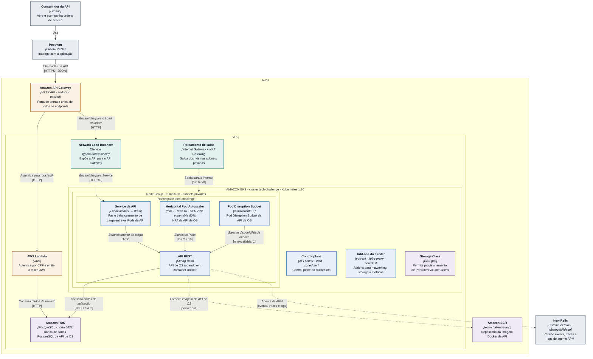

# C4 Model: Diagrama de Componentes

Visão macro da infraestrutura do projeto da Fase 3 do Tech Challenge.

## Diagrama

```mermaid
flowchart TB
  classDef externo    fill:#E9ECF1,stroke:#5A6577,stroke-width:1.5px,color:#131A24
  classDef borda      fill:#FBF1E4,stroke:#A4611F,stroke-width:1.5px,color:#131A24
  classDef rede       fill:#E3F1EF,stroke:#1B6E68,stroke-width:1.5px,color:#131A24
  classDef k8s        fill:#E9EFF9,stroke:#2B5FA8,stroke-width:1.5px,color:#131A24
  classDef dados      fill:#F0EAF6,stroke:#6A4A85,stroke-width:1.5px,color:#131A24

  pessoa["<b>Consumidor da API</b><br/><i>[Pessoa]</i><br/>Abre e acompanha ordens de serviço"]
  postman["<b>Postman</b><br/><i>[Cliente REST]</i><br/>Interage com a aplicação"]
  newrelic["<b>New Relic</b><br/><i>[Sistema externo · observabilidade]</i><br/>Recebe events, traces e logs do agente APM"]

  subgraph aws["AWS"]
    direction TB

    apigw["<b>Amazon API Gateway</b><br/><i>[HTTP API - endpoint público]</i><br/>Porta de entrada única de todos os endpoints"]
    ecr["<b>Amazon ECR</b><br/><i>[tech-challenge-app]</i><br/>Repositório da imagem Docker da API"]

    subgraph vpc["VPC"]
      direction TB

      nlb["<b>Network Load Balancer</b><br/><i>[Service type=LoadBalancer]</i><br/>Expõe a API para o API Gateway"]
      rota["<b>Roteamento de saída</b><br/><i>[Internet Gateway + NAT Gateway]</i><br/>Saída dos nós nas subnets privadas"]
      rds["<b>Amazon RDS</b><br/><i>[PostgreSQL - porta 5432]</i><br/>Banco de dados PostgreSQL da API de OS"]
      lambda["<b>AWS Lambda</b><br/><i>[Java]</i><br/>Autentica por CPF e emite o token JWT"]

      subgraph eks["AMAZON EKS - cluster tech-challenge - Kubernetes 1.36"]
        direction TB

        cp["<b>Control plane</b><br/><i>[API server · etcd · scheduler]</i><br/>Control plane do cluster k8s"]
        addons["<b>Add-ons do cluster</b><br/><i>[vpc-cni · kube-proxy · coredns]</i><br/>Addons para networking, storage a métricas"]
        sc["<b>Storage Class</b><br/><i>[EBS gp3]</i><br/>Permite provisionamento de PersistentVolumeClaims"]

        subgraph ng["Node Group - t3.medium - subnets privadas"]
          direction TB

          subgraph ns["Namespace tech-challenge"]
            direction TB

            svcapi["<b>Service da API</b><br/><i>[LoadBalancer → 8080]</i><br/>Faz o balanceamento de carga entre os Pods da API"]
            hpa["<b>Horizontal Pod Autoscaler</b><br/><i>[min 2 · max 10 · CPU 70% e memória 80%]</i><br/>HPA da API de OS"]
            pdb["<b>Pod Disruption Budget</b><br/><i>[minAvailable: 1]</i><br/>Pod Disruption Budget da API de OS"]
            app["<b>API REST</b><br/><i>[Spring Boot]</i><br/>API de OS rodando em container Docker"]
          end
        end
      end
    end
  end

  pessoa   -->|"<i>Usa</i>"| postman
  postman  -->|"<i>Chamadas na API</i></br>[HTTPS - JSON]"| apigw
  apigw    -->|"<i>Autentica pela rota /auth</i></br>[HTTP]"| lambda
  apigw    -->|"<i>Encaminha para o Load Balancer</i></br>[HTTP]"| nlb
  lambda   -->|"<i>Consulta dados de usuário</i></br>[HTTP]"| rds
  nlb      -->|"<i>Encaminha para Service</i></br>[TCP :80]"| svcapi
  svcapi   -->|"<i>Balanceamento de carga</i></br>[TCP]"| app
  hpa      -->|"<i>Escala os Pods</i></br>[De 2 a 10]"| app
  pdb      -->|"<i>Garante disponibilidade minima</i></br>[minAvailable: 1]"| app
  app      -->|"<i>Consulta dados da aplicação</i></br>[JDBC :5432]"| rds
  app      -.->|"<i>Fornece imagem da API de OS</i></br>[docker pull]"| ecr
  rota     -.->|"<i></i>Saída para a internet</br>[0.0.0.0/0]"| ng
  app      -.->|"<i></i>Agente de APM</br>[events, traces e logs]"| newrelic

  class pessoa,postman,newrelic externo
  class apigw,lambda borda
  class nlb,rota rede
  class cp,addons,svcapi,hpa,pdb,app k8s
  class ecr,sc,rds dados
```
