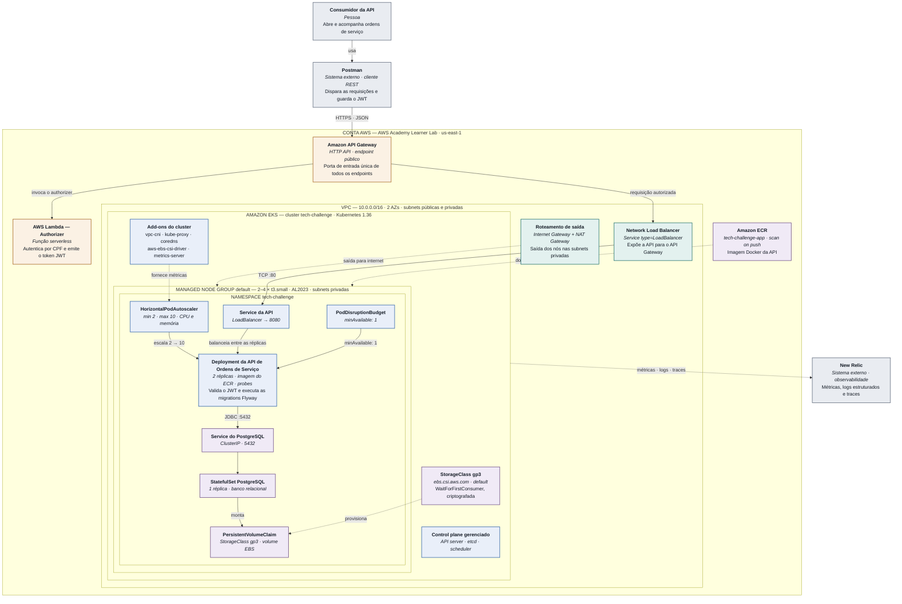

# Diagrama de Componentes — C4 Model (Nível 3)

Visão macro da infraestrutura do **Tech Challenge Fase 3**: a borda serverless que autentica
e roteia as chamadas, o cluster Kubernetes gerenciado onde a aplicação e o banco executam, e
o armazenamento persistente por trás deles.

Conforme orientado na live, este diagrama fica no **nível mais macro possível** e é voltado à
infraestrutura — os recursos que estão na nuvem AWS. Ficam deliberadamente de fora o
funcionamento interno da API (camadas, casos de uso, entidades) e as pipelines de CI/CD dos
quatro repositórios.

| | |
| --- | --- |
| Conta | AWS Academy Learner Lab |
| Região | `us-east-1` |
| VPC | `10.0.0.0/16` · 2 AZs |
| Cluster | `tech-challenge` · Kubernetes `1.36` |
| Namespace | `tech-challenge` |
| Registro de imagens | ECR `tech-challenge-app` |

## Diagrama

### Legenda de cores

| Cor | Família | Exemplos |
| --- | --- | --- |
| Cinza-azulado | Externo — fora da conta AWS | Consumidor, Postman, New Relic |
| Ocre | Borda serverless gerenciada | API Gateway, Lambda Authorizer |
| Teal | Rede | VPC, NLB, Internet/NAT Gateway |
| Azul | Kubernetes | Control plane, add-ons, Deployment, HPA, PDB |
| Violeta | Dados e armazenamento | ECR, StorageClass, PostgreSQL, PVC |

Linhas contínuas representam o caminho de uma requisição; linhas tracejadas representam
relações de suporte (provisionamento, telemetria, pull de imagem).

## Fluxo de uma requisição

1. **Postman → API Gateway.** A requisição HTTPS chega ao endpoint público do API Gateway,
   única porta de entrada da aplicação.
2. **API Gateway → Lambda Authorizer.** Nos endpoints protegidos, o gateway invoca a função
   Lambda, que autentica pelo CPF e emite o token JWT.
3. **API Gateway → Network Load Balancer.** Com a autorização concedida, a chamada é
   encaminhada ao balanceador criado pelo Service da aplicação.
4. **NLB → Service → Deployment.** O tráfego entra no cluster e é distribuído entre as
   réplicas da API, que validam o JWT recebido.
5. **Deployment → Service do PostgreSQL.** A aplicação consulta e grava a ordem de serviço
   via JDBC na porta 5432.
6. **StatefulSet → PVC → EBS.** O banco persiste os dados no volume EBS gp3 provisionado
   pelo CSI driver.
7. **HPA → Deployment.** Em paralelo, o autoscaler lê as métricas do `metrics-server` e
   ajusta as réplicas entre 2 e 10; o PodDisruptionBudget mantém ao menos uma no ar.

## Quem provisiona cada componente

A arquitetura é entregue por quatro repositórios independentes. O diagrama mostra o resultado
combinado; cada repositório é dono apenas da sua fatia.

| Componente | Repositório | Observação |
| --- | --- | --- |
| API Gateway | Autenticação | Pode ser criado junto da Lambda (SAM) ou no repositório de infraestrutura — decisão do time |
| Lambda Authorizer | Autenticação | Repositório próprio, com pipeline própria |
| VPC, NAT e Internet Gateway | Infraestrutura (este) | Módulo `terraform-aws-modules/vpc/aws` |
| Cluster EKS e add-ons | Infraestrutura (este) | Recursos nativos `aws_eks_cluster` e `aws_eks_addon` |
| Managed node group | Infraestrutura (este) | `aws_eks_node_group` com launch template próprio |
| Namespace e StorageClass | Infraestrutura (este) | Compartilhados; criados aqui para os outros dois repositórios não disputarem a posse |
| Amazon ECR | Infraestrutura (este) | O repositório é provisionado aqui; o build e o push da imagem são da pipeline da aplicação |
| StatefulSet, Service e PVC do banco | Banco de dados | Consome o namespace e a StorageClass pelo state remoto |
| Deployment, Service, HPA e PDB | Aplicação | Inclui ConfigMap, Secret e as migrations Flyway |

## Fora do escopo

- Funcionamento interno da API (camadas, casos de uso, entidades) — pertence a um diagrama
  de nível de código, não de infraestrutura.
- Pipelines de CI/CD dos quatro repositórios.
- Bucket S3 do state do Terraform: existe fora do ciclo de vida da aplicação e é criado
  manualmente (`script-criar-backend.sh`) antes de qualquer `apply`.
