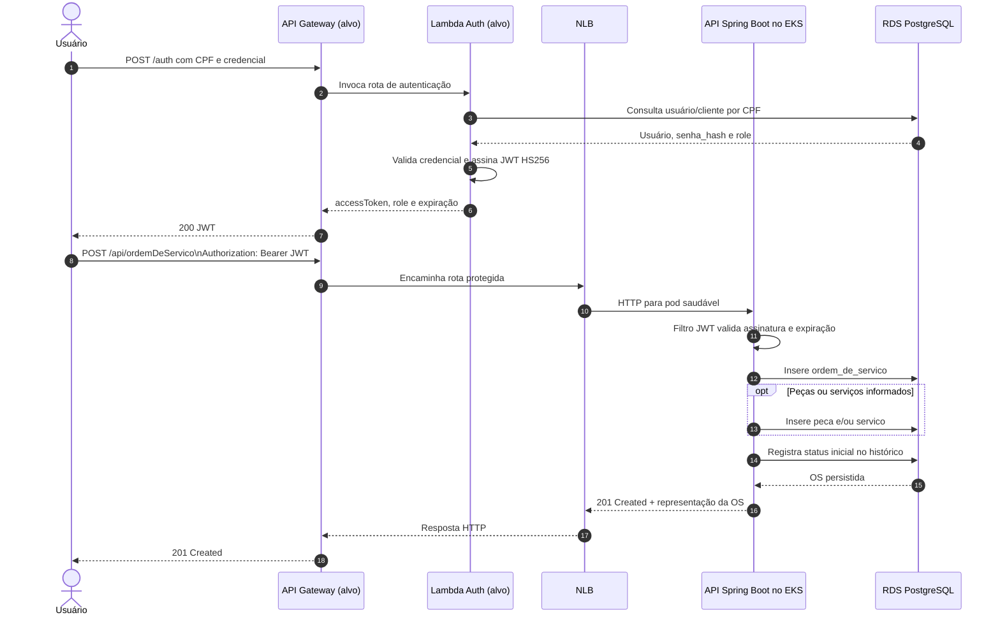

# Diagrama de Sequênica - Fluxos de autenticação e abertura de ordem de serviço

O diagrama a seguir mostra o fluxo requerido, incluindo a arquitetura-alvo de API Gateway/Lambda. Os passos marcados como **alvo** dependem dos componentes ainda ausentes; os demais representam o comportamento existente no código.

